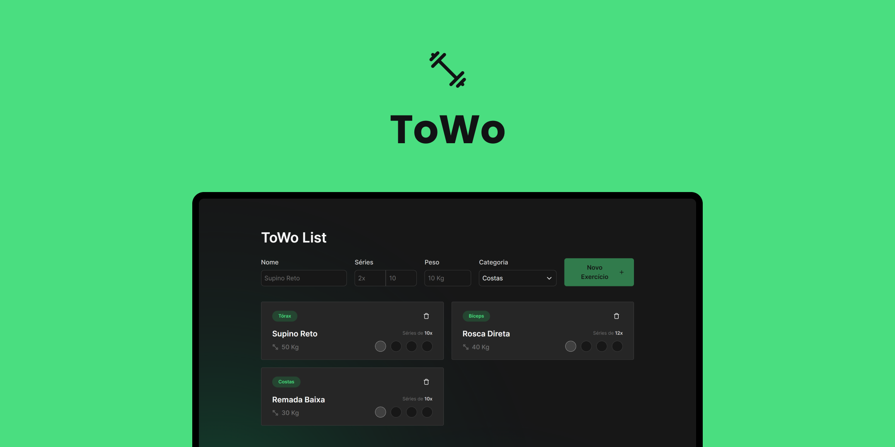
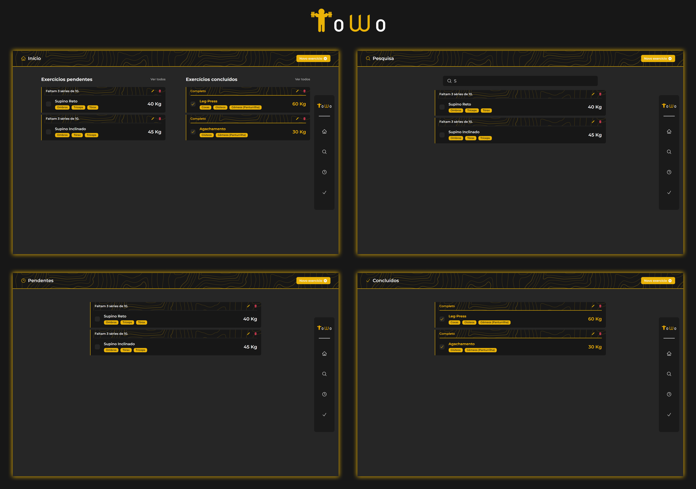
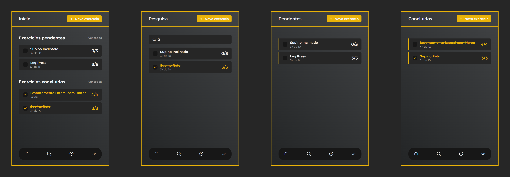

# ToWo List
## :muscle: **Projeto**



> Cansado de se cansar contando enquanto devia estar praticando seus exercícios? Chega de roubar nas séries e enganar o Personal, a ToWo está aqui!

A ToWo List é uma aplicação voltado para o registro de suas atividades físicas, especificamente, atividades que envolvam séries de exercícios. Com ela, você registra a quantidade de repetições por série da sua atividade e acompanha seu progresso até a conclusão da atividade.

<p align="center">
   <a href="https://tomo-list.vercel.app">Veja o projeto completo aqui.</a>
</p>

## :art: **Visual do Projeto**
### *Desktop e Telas Maiores*
<h1 align="center">
    
</h1>

### *Mobile e Telas Menores*
<h1 align="center">
    
</h1>

## :wrench: **Tecnologias**
Tecnologias utilizadas no projeto.

### :hammer: **Construção do site**

* [HTML](https://developer.mozilla.org/pt-BR/docs/Web/HTML)
* [JavaScript](https://developer.mozilla.org/pt-BR/docs/Web/JavaScript)
* [TypeScript](https://www.typescriptlang.org)
* [Vue.js](https://vuejs.org)
* [Node e NPM](https://nodejs.org/)
* [Vite](https://vitejs.dev/)

### :art: **Estilização**

* [CSS](https://developer.mozilla.org/pt-BR/docs/Web/CSS)
* [Tailwind CSS](https://tailwindcss.com)
* [Remixicon](https://remixicon.com)
* [Google Fonts](https://fonts.google.com)

### :open_file_folder: **IDE, Versionamento e Deploy**

* [Visual Studio Code](https://code.visualstudio.com)
* [Git](https://git-scm.com)
* [GitHub](https://github.com)
* [Vercel](https://vercel.com/)

## :rocket: **Configurações e Instalação**

Veja [documentação de configuração do Vite](https://vitejs.dev/config/) e a instalação do [Volar](https://marketplace.visualstudio.com/items?itemName=Vue.volar).

### **Clonando o Projeto**

```sh
git clone https://github.com/davsilvam/tomo-list.git
```

### **Executando o Projeto**

```sh
npm install
```

### **Compilar e abrir o programa para desenvolvimento**

```sh
npm run dev
```

### **Compilar e reduzir para produção**

```sh
npm run build
```

## :balance_scale: **Licença**

Esse projeto está sob a [licença MIT](https://github.com/davsilvam/tomo-list/blob/main/LICENSE.md).

<p align="center">
  Feito com :blue_heart: por <a href="https://www.linkedin.com/in/davsilvam/">David Silva</a>.
</p>

---
