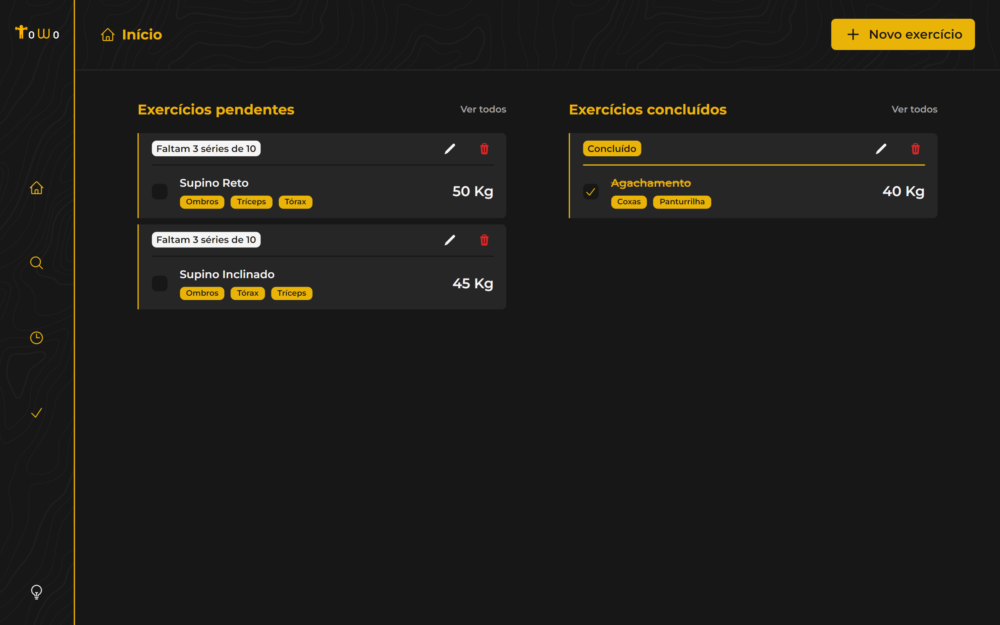
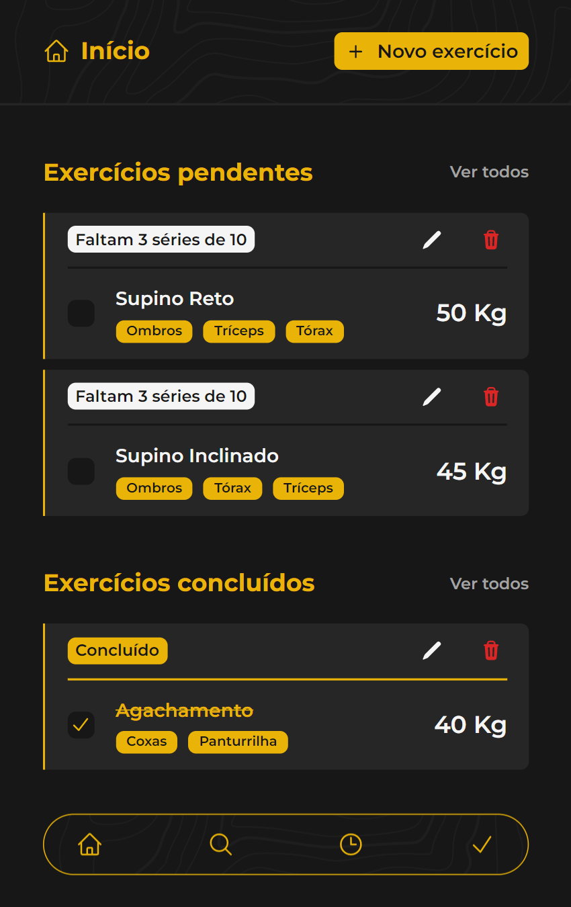

# ToWo List

## :muscle: **Projeto**


> Cansado de se cansar contando enquanto devia estar praticando seus exercícios? Chega de roubar nas séries e enganar o Personal, a ToWo está aqui!

A ToWo List é uma aplicação voltado para o registro de suas atividades físicas, especificamente, atividades que envolvam séries de exercícios. Com ela, você registra a quantidade de repetições por série da sua atividade e acompanha seu progresso até a conclusão da atividade.

<p align="center">
   <a href="https://towo-list.vercel.app">Veja o projeto completo aqui.</a>
</p>

## :art: **Visual do Projeto**

### _Desktop e Telas Maiores_

<h1 align="center">
    
</h1>

### _Mobile e Telas Menores_

<h1 align="center">
    
</h1>

## :wrench: **Tecnologias**

Tecnologias utilizadas no projeto.

### :hammer: **Construção do site**

- [TypeScript](https://www.typescriptlang.org)
- [Vue.js](https://vuejs.org)
- [Vite](https://vitejs.dev/)

### :art: **Estilização**

- [Tailwind CSS](https://tailwindcss.com)
- [Heroicons](https://heroicons.com)
- [Headless UI](https://headlessui.com)
- [Google Fonts](https://fonts.google.com)

### :open_file_folder: **IDE, Versionamento e Deploy**

- [Visual Studio Code](https://code.visualstudio.com)
- [Git](https://git-scm.com)
- [GitHub](https://github.com)
- [Vercel](https://vercel.com/)

## :rocket: **Configurações e Instalação**

### Requisitos
- [Node e NPM](https://nodejs.org/)
- [Volar](https://marketplace.visualstudio.com/items?itemName=Vue.volar)

Recomendo que veja a [documentação de configuração do Vite](https://vitejs.dev/config/). 

```sh
# Clonando o projeto
git clone https://github.com/davsilvam/towo-list.git

# Instalando as dependências
npm install

# Compilar e abrir o programa para desenvolvimento
npm run dev

# Compilar e minificar para produção
npm run build
```

## :balance_scale: **Licença**

Esse projeto está sob a [licença MIT](https://github.com/davsilvam/towo-list/blob/main/LICENSE.md).

<p align="center">
  Feito com :blue_heart: por <a href="https://www.linkedin.com/in/davsilvam/">David Silva</a>.
</p>

---
