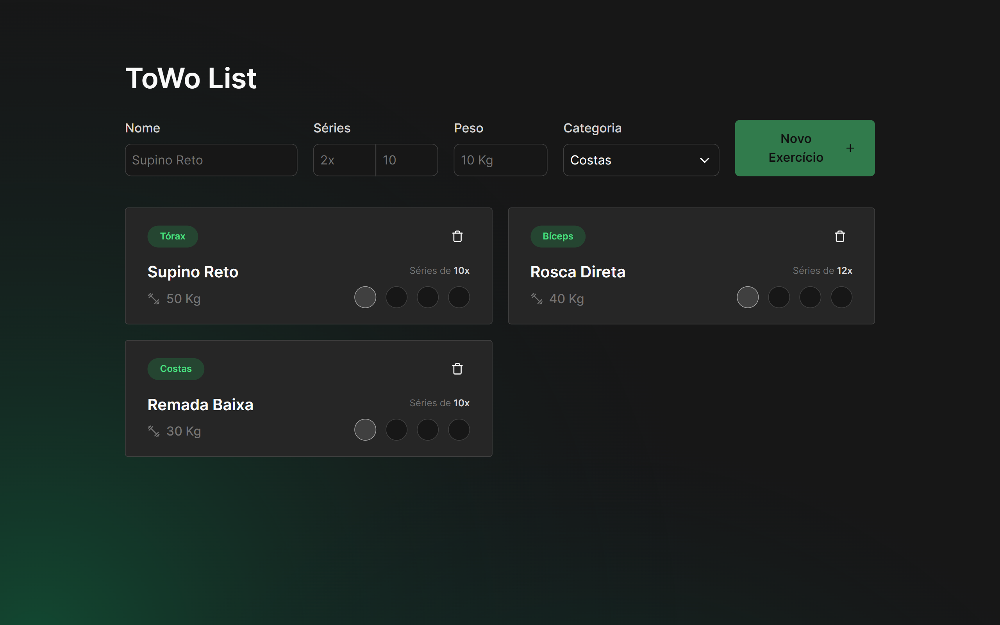
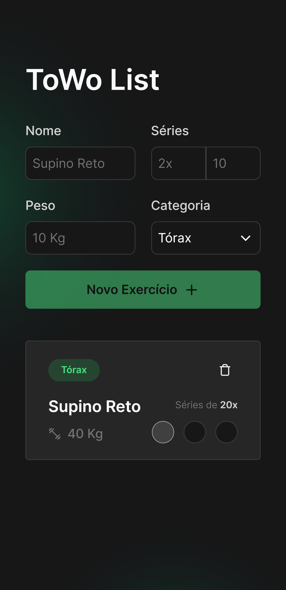

# ToWo List


## :bookmark: **Sumário**
- [Sobre o Projeto](#weight_lifting_man-sobre-o-projeto)
- [Visual do Projeto](#art-visual-do-projeto)
   - [Desktop e Telas Maiores](#desktop-e-telas-maiores)
   - [Mobile e Telas Menores](#mobile-e-telas-menores)
- [Tecnologias](#wrench-tecnologias)
   - [Construção do site](#construção-do-site)
   - [Estilização](#estilização)
   - [IDE, Versionamento e Deploy](#ide-versionamento-e-deploy)
- [Configurações e Instalação](#rocket-configurações-e-instalação)
     - [Requisitos](#requisitos)
- [Licença](#balance_scale-licença)

## :weight_lifting_man: **Sobre o Projeto**

ToWo List é uma aplicação que visa registrar séries de atividades a serem realizadas, com o objetivo de ajudar o usuário a organizar suas tarefas e a gerenciar seu tempo.

<p align="center">
   <a href="https://towo-list.vercel.app">Veja o projeto completo aqui.</a>
</p>


## :art: **Visual do Projeto**

### _Desktop e Telas Maiores_

<h1 align="center">
    
</h1>

### _Mobile e Telas Menores_

<h1 align="center">
    
</h1>

## :wrench: **Tecnologias**

Tecnologias utilizadas no projeto.

### **Construção do site**

- [TypeScript](https://www.typescriptlang.org)
- [Vue 3](https://vuejs.org)
- [Vite](https://vitejs.dev)
- [Radix Vue](https://www.radix-vue.com)
- [Headless UI](https://headlessui.com)

### **Estilização**

- [Tailwind CSS](https://tailwindcss.com)
- [Lucide Icons](https://lucide.dev)

### **IDE, Versionamento e Deploy**

- [Visual Studio Code](https://code.visualstudio.com)
- [Git](https://git-scm.com)
- [GitHub](https://github.com)
- [Vercel](https://vercel.com/)

## :rocket: **Configurações e Instalação**

### Requisitos

- [Node](https://nodejs.org/) e um gerenciador de pacotes, usei [pnpm](https://pnpm.io/pt/).

Recomendo que veja a [documentação de configuração do Vite](https://vitejs.dev/guide/).

```sh
# Clonando o projeto
git clone https://github.com/davsilvam/towo-list.git

# Instalando as dependências
pnpm install

# Compilar e abrir o programa para desenvolvimento
pnpm run dev

# Compilar e minificar para produção
pnpm run build
```

## :balance_scale: **Licença**

Esse projeto está sob a [licença MIT](https://github.com/davsilvam/towo-list/blob/main/LICENSE.md).

---

Feito com 💚 e ☕ por <a href="https://www.linkedin.com/in/davsilvam/">David Silva</a>.

> [Portfólio](https://davidsilvam.vercel.app) &nbsp;&middot;&nbsp;
> GitHub [@davsilvam](https://github.com/davsilvam) &nbsp;&middot;&nbsp;
> Instagram [@davsilvam_](https://www.instagram.com/davsilvam_/)


<p align="center">
  Feito com 💚 e ☕ por <a href="https://www.linkedin.com/in/davsilvam/">David Silva</a>.
</p>

---
